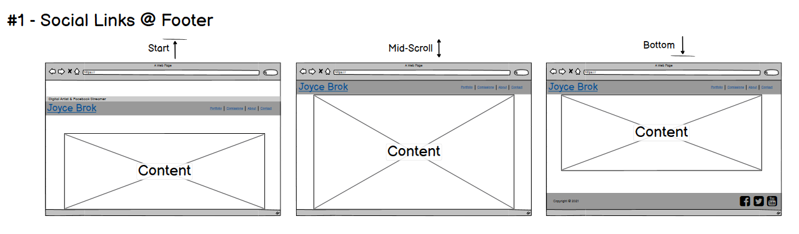
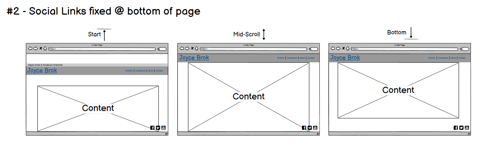
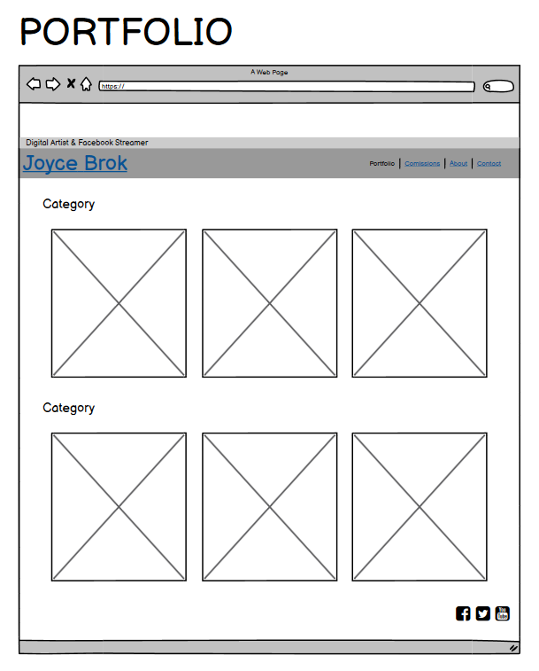
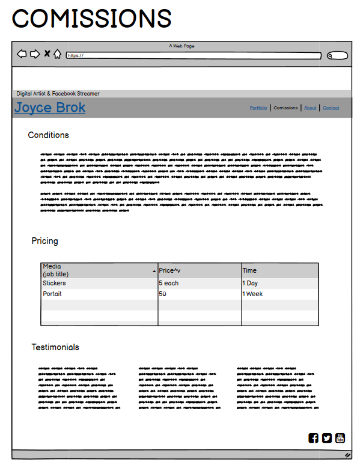
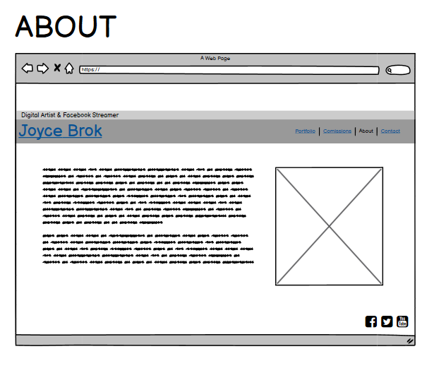
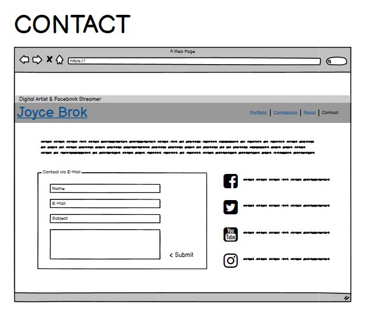
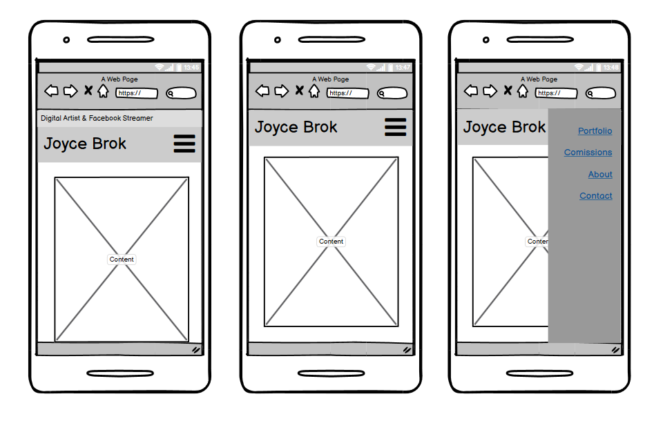
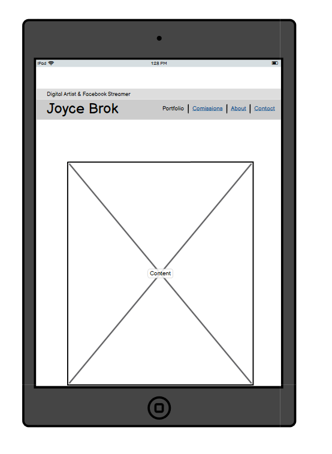

## Portfolio Website for a Digital Artist

This website is meant as a landing page for a digital artist and facebook streamer. It will cover her portfolio, pricing information as well as a bit of information about the artist, including multiple methods to contact.

-   ### User stories

    -   #### First Time Visitor Goals (Visitor stumbles upon the website)

        1. As a first time visitor, I want to quickly understand the purpose of the website
        2. As a first time visitor, I want to find the portfolio of the artist
        3. As a first time visitor, I want to be able to quickly navigate the sites different sections on any device I happen to use at the time

    -   #### Redirected First Time Visitor Goals (Visitor has an idea what to expect)

        1. As a first time visitor, I want to find the portfolio of the artist
        2. As a first time visitor, I want to be able to quickly navigate the sites different sections on any device I happen to use at the time
        3. As a first time visitor, I want to find to find information about pricing, commission availability as well as contact details 

    -   #### Returning Visitor Goals

        1. As a returning visitor, I want to easily see new work of the artist
        2. As a returning visitor, I want to be able to find information on possible price changes and commission availability changes

-   ### Wireframes
    - Flow:

        
        
    - Content:

        
        
        
        
        

    - Mobile UI:

        
        