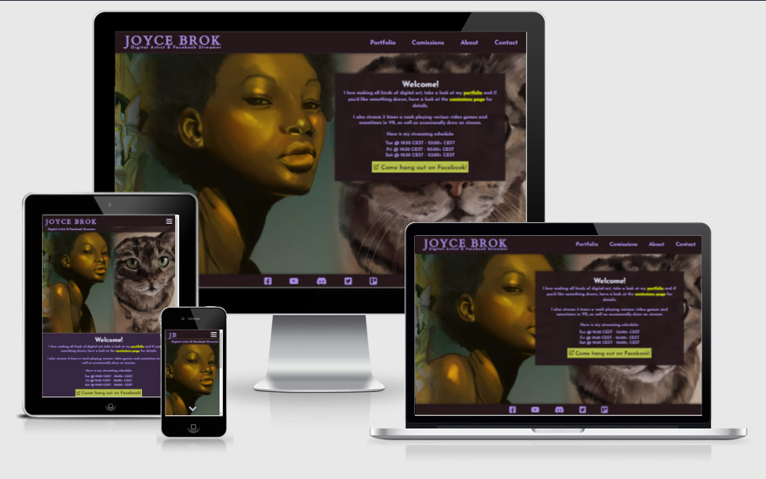
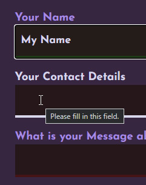

# **Milestone Project 1 - Joyce Brok**
## Portfolio Website for a Digital Artist - [View deployed site here.](https://chrotesque.github.io/ci-portfolio-project-1/)

 

# Table of Contents

1. [Overview](#overview-)
2. [UX](#ux-)
    * [Strategy](#strategy)
        * [Target Audience](#target-audience)
        * [Business Goals](#business-goals)
        * [User Stories](#user-stories)
    * [Scope](#scope)
    * [Structure](#structure)
    * [Skeleton](#skeleton)
        * [Navigation](#navigation)
        * [5 Separate Pages](#5-separate-pages)
        * [Wireframes](#wireframes)
    * [Surface](#surface)
        * [Navigation Design](#navigation-design)
        * [Color Scheme](#color-scheme)
3. [Features](#features-)
    * [Responsive Design](#responsive-design)
    * [Navigation and Footer](#navigation-and-footer)
    * [Hero Image](#hero-image)
    * [Portfolio](#portfolio)
    * [Comissions](#comissions)
    * [About](#about)
    * [Contact](#contact)
    * [General](#general)
4. [Technologies Used](#technologies-used-)
5. [Validation and Testing](#validation-and-testing-)
    * [Validation](#validation)
    * [Testing](#testing)
    * [Google Lighthouse](#google-devtools-lighthouse)
    * [User Story Testing](#user-story-testing)
6. [Bugs](#bugs-)
    * [Resolved Bugs](#resolved-bugs)
7. [Deployment](#deployment-)
8. [Credits](#credits-)
9. [Statistics](#statistics-)
10. [Acknowledgements](#acknowledgements-)

 

# **Overview** ([^](#table-of-contents))

A website meant for the artist as place to showcase her portfolio as well as providing necessary information for potential new customers while offering a glimpse into the artist herself. While the title states "Digital Artist & Facebook Streamer" the focus is on the aspect of being an artist, with intentional rare mentions of the streaming aspect. It covers a select portfolio, pricing information, process of ordering and receiving work done as well as a bit of information about the artist, including various methods to establish contact.

 

# **UX** ([^](#table-of-contents))

* ## **Strategy**
    ### **Target Audience**
    The target audience of this website are people that are looking to have affordable custom made artwork for various purposes, so far the range includes posters, logos, stickers, tattoos, portraits and various others. Once contact has been established, the website will be less useful, thus the main focus is on first time visitors as subsequent contact will take place off the website and new additions to the portfolio won't matter to existing customers, only to new ones. 

    ### **Business Goals**
    - Acquiring new clients to grow in reach ultimately
    - Setting expectations before a client contacts the artist
    - Simplifying the process of contact the artist by offering many options to do so, without automating the entire process to allow the artist to select clients to work with

    ### **User Stories**
    -   First Time Visitor Goals (Visitor stumbles upon the website)
        1. As a first time visitor, I want to quickly understand the purpose of the website
        2. As a first time visitor, I want to find the portfolio of the artist
        3. As a first time visitor, I want to be able to quickly navigate the sites different sections on any device I happen to use at the time

    -   Redirected First Time Visitor Goals (Visitor has an idea what the website is about)
        1. As a first time visitor, I want to find the portfolio of the artist
        2. As a first time visitor, I want to find to find information about pricing, commission process as well as contact details 

    -   Returning Visitor Goals
        1. As a returning visitor, I want to be able to review the comission process in case contact is temporarily interrupted (schedules, sleeping rhythms, etc.)
        2. As a returning visitor, I want to be able to find contact information in case it has been lost

 

* ## **Scope**
    The website will offer: 
    - a fully responsive design for ease of use on any device
    - a selection of the artist's portfolio
    - information about the comission process including pricing
    - many ways to contact the artist to ease the process of interacting
    - a bit of information about the artist

 

* ## **Structure**
    - The contents are segmented into clearly separated logical sections
    - The navigation lists content in the order of importance with one big exception: about before contact - contact being the last menu point seems to be a agreed upon standard that is prevalent on most websites; if it was truly about importance then it would change to Portfolio > Comissions > Contact > About
    - The purpose of the website is briefly explained on the landing / home page, first direct mention of streaming activities by giving out streaming schedule
    - The portfolio to show visitors a broad range of the artists work to help with the decision of purchasing art
    - The comissions page is required to offer information about pricing and if the product meets the visitors needs (DPI, file format, file size, etc.)
    - The dedicated contact page offers every imaginable way of contacting the artist (that she's also willing to offer, excluding a phone number as well as physical address) while social links are provided on every single page for ease of use 
    - The about page offers a bit of information about the artist, 2nd mention of streaming activities by also offering previously recorded streams as videos on Youtube

 

* ## **Skeleton**
    ### **Navigation**
    - strictly separates the contents of the page into logical sections to make it obvious what information will and can be accessed and where
    - all parts of the website are available at all times through the navigation
    - navigation is always at the top of the screen to be always accessible

     

    ### **5 Separate Pages**
    - each part of the website handles different kinds of information, thus various methods are used for display:
       - the landing page (index) greets the visitor with a scrolling background image showcasing various works taken from the portfolio mashed together while explaining the purpose in a separate boxed-in portion
        - the portfolio is column based with various columns depending on device width, the user can open a picture to focus on it / see more details by tapping / clicking on it
        - the comissions page details the process first as ordered list, then switches to an appropriate table format for current prices for the services rendered and finishes with 3 stacked paragraphs a few select testimonials from previous clients, on smaller devices these segments stack vertically
        - the about page shows the artist in a picture, surrounded by a small introduction and additional information about the artist and finishes off at the bottom with a bit of information about streaming activities and 2 previously recorded streams hosted on Youtube, as on other pages these distinct segments stack vertically on smaller devices
        - the contact page starts with text to set expectations and listing preferences, followed by a responsive form vertically stacked regardless of device, upon successful use of the form a success message is being displayed on the page while still allowing the use of the form

     

    ### **Wireframes**
    

    
Flow with different positions for social icons (click to expand)

    
    

    

    

    
Content wireframes for desktop (click to expand)

    
    
    
    
    

    

    

    
Mobile UI (click to expand)

    

    

     

    #### **Differences from wireframes to result**
    - During the first mentor session I heard the term "mobile first" and decided to change my approach, the wireframes preceeded that meeting and were not updated to reflect that change in approach which is why the content is sketched out entirely on desktop versions but not for mobile or tablets
    - The lightbox feature of the gallery was not thought about until my Mentor mentioned it in the 2nd mentor session 

    #### **Limitations**
    - The final implementation of a carousel was born out of the frustration of not understanding keyframes from online examples, it was meant as placeholder and "good enough"-implementation until the very end when I would then decide to either finish the project or leave it be. It turned out better than anticipated and replaced the original carousel 
    - The lightbox feature used seemingly does not allow the use of the picture element, thus making it impossible to offer webp format for browsers that support it, specifically this line would simply not work:  `img.thumbnail:focus+.lightbox`

     

* ## **Surface**
    ### **Navigation Design**
    - The top bar contains the artists name on the left side and the navigation to the right
    - The navigation is consistent between desktop and mobile versions in it's behaviour, as it sticks to the top of the page to always be available.
        - On mobile it uses a standard hamburger menu to reduce space. The hamburger menu then offers all social links as well as internal navigation links. 
        - On the desktop version it separates social links and internal navigation as space is no longer a concern
    - There are intentional functional and visual inconsistencies:
        - The top left bar featuring the artist's name remains fixed on the top on desktop as it is visually part of the navigation
        - It is not fixed on the mobile version to not waste any space on smaller screens and to follow the mantra "mobile first, content first"; as it is part of every page and will be displayed upon loading another page, however as it is not functional nor can be considered "content" which is why I decided to detach it from the navigation and it'll be scrolled out of view
        - The landing / index page features a full screen scrolling hero image while all other pages use a "boxed-in" model, the idea here being that the page is about an artist and thus it should take center stage, also I feel it looks much better than using the same box-model for the hero image as well

    ### **Color Scheme**
    - The color scheme used evolved throughout the project, however purple being the favourite and signature color of the artist I chose all the other colors using [Coolors](#technologies-used-) to work with the main color purple:

        

        - Primary Colors:
            - `#D8D6EB` - highlight color for important and interactive elements
            - `#A68CE3` - main font color for normal text as well as border-bottom color for various elements as accents
            - `#372640` - body background color
            - `#25171A` - background color for elements further in the front, like the top bar, footer, etc. also used for fonts that are being highlighted to contrast the highlight color; also being used in various different opacities for transparency to create more subtle effects
            - `#CEE002` - color for text links, complementary color to varioous shades of blue/purple
            - `#B3BF49` - similar but lower impact shade of the text link color, used for navigation elements as background to signify the active page
            - `#595478` - deeper shade of purple used on the gallery for images that have transparent backgrounds
        - Secondary Colors:
            - `#00ff00` - pure green used to display the success message on the contact page, including a 50% alpha version as text shadow
            - `#451416` - similar to other elements on the website, the input fields also have border-bottom accents to signify in this case specifically whether or not a field has been filled out or not, in this case meaning the field is still empty
            - `#1f3a16` - similar to above, this signifies a filled out field
            - `#241c19` - this is the respective background color for the border-bottom accent color mentioned above
            - `shades `of white and black for shadows

 

# Features ([^](#table-of-contents))
## Responsive Design
- Generally speaking the website is optimized for 3 sizes: < 768px, 768px to 1200px and 1200px >, these are the break points at which elements see a greater change; based off of [statcounter](#technologies-used-)
    - 360x640 is the smallest mobile screen that is used by the majority of users
    - 768x1024 is by far the most common tablet screen size
    - 1920x1080 is the most common desktop screen size to this date, with only roughly 2% even reaching 2560x1440 
- However all elements scale nicely in between all these sizes, the minimum supported size is 218px x 218px, that should cover the vast array of different screen sizes out there on mobile
- I've used various more specialized media queries for very specific effects and/or purposes, for which I will go into more detail further down
- The site would require comically large scaling for screens bigger than 1440p as there is simply not enough content to fill the extra room, as mentioned above only 2% of users are even on 1440p, thus this shouldn't pose much of a problem

## Navigation and Footer
- On mobile, the navigation consists of the hamburger style icon and once opened, the menu consists of internal navigation on the right and the footer (social links) on the left - this allows the visitor access to all relevant links at any given point with a single tap, no scrolling required:

    

    

- On desktop, the style changes to a full navigation and a footer at the bottom of the content with the social links, on the dekstop version the title becomes the home button, which is common on websites these days - the social links are not as quickly accessible as they are on mobile, however a single button press on keyboard will typically get the user to the bottom of the page if required. In addition to that, having social links in the footer is also common practice:

    
    

    Consistency is broken here in regards to links being generally of a green color, however it simply looked odd and felt wrong to force consistency upon the navigation coming from the way I handle links and the submit button on the website.

## Hero Image
- The index is a landing page, showcasing select pieces from the portfolio in the background while giving all necessary info as to what the page is about - this gives the visitor a broad range of artwork from the artist right away:

    

- On mobile I decided to have the hero image at the top, if enough text content on the bottom is visible, if the device is not wide enough the name reverts to initials:

    
    

    Consistency is broken with the subtitle right underneath on mobile only, due to possible size constraints depending on the device being used and the user most likely seeing the landing page first, the subtitle is invisible on all other sub pages to maximize usable screen estate:

    
    

- If not enough text content is visible, a down arrow / chevron icon is being displayed to convey that there's more further down:

    

## Portfolio
- The portfolio shows a selection of images made by the artist in a simple tile pattern & each picture can be focused on via tap/click and then also displays the title of the picture:

    
      

## Comissions
- The comissions page offers all required information to correctly set expectations in 3 simple sections: Process > Pricing > Testimonials 

## About
- The about page features iframe elements are the bottom showcasing 2 videos from the artists youtube channel which retain their aspect ratio while always remaining responsive, they only play once a visitor clicks on the play button in the middle of the preview, the link uses the privacy-enhanced link which does not collect any information, until the video is being played

## Contact
- The form on the contact page consists of 4 input fields, it uses css to subtly suggest what fields still require information (on the left) and since all fields are required to be filled in, the browser will otherwise be less subtle (on the right): 

    
    

    Consistency is broken when it comes to the buttons, as they feature different styles. The idea here is to emphasize on the submit "Contact Me"-button, making the reset button less intrusive, *especially since it will wipe all user inputs without warning*.

- I decided against any kind of validation on those input fields; a real name was never required for any interaction the artist had with previous clients and sometimes a handle is all that is known, similarily contact details might be an email address, a social media handle, etc.

- The subject input field "What is your Message about?" is a combination of an input field and select tag, making it possible to offer a few typically selected useful subject lines while also giving the user the option to just type whatever they want. It's not a perfect solution as once a prewritten subject line has been selected it's not entirely clear how to get back to the full selection. Since it still allows the user to type in custom text, I decided to stich with this solution.

- Once sent, the page will display another version of the contact form with a success message, while allowing the user to sent another message (just in case):

    

## General
- There is a variety of links referring to pages internally to guide the visitor from one section to another, depending on the location - these are purely text based. External text links on the other hand are always marked with an icon to avoid any confusion as to where they are leading:

    

- I use hover effects on the desktop version for the visitor to highlight interactive elements, provide feedback and to help on page navigation; where I deemed it functionally necessary on the portfolio as well as navigation it also complies with accessibility contrast requirements:

    

    

    

    

    
    
    

 

# Technologies Used ([^](#table-of-contents))
- Main languages: [HTML5](https://en.wikipedia.org/wiki/HTML5) & [CSS3](https://en.wikipedia.org/wiki/Cascading_Style_Sheets)
- [Google Fonts](https://fonts.google.com/) used for fonts throughout the whole site
- [Font Awesome](https://fontawesome.com/) used for a few select icons to be able to style them as font/text
- [Git](https://git-scm.com/) used for version control through the Gitpod terminal for deployment onto Github
- [GitHub](https://github.com/) used as host and for deployment of the site
- [Gitpod](http://gitpod.com) used as IDE
- [ClickUp](http://clickup.com) used for project management and to track time used on the project
- [WakaTime](https://wakatime.com) used as time tracking replacement for ClickUp towards the end of the project as per recommendation of my mentor due to it's automated nature
- [Adobe Photoshop 2021](https://www.adobe.com/products/photoshop.html) used for image optimization, saving files in WEBP format as well as creating the collage images used on the front page of this project
- [TinyPNG](https://tinypng.com/) used to optimize JPG and PNG file sizes for this project
- [Lettercounter](https://lettercounter.github.io/) used to keep commit messages below or at 50 characters
- [Am I Responsive?](http://ami.responsivedesign.is/) used to create responsive preview of the site used at the top of this readme
- [Coolors](https://coolors.co/) used to create a color palette for this project
- [Balsamiq](https://balsamiq.com/) used to create the wireframes during the initial design stage
- [Statcounter](https://gs.statcounter.com/screen-resolution-stats) used as resource to optimize website for various commonly used resolutions as a priority

 

# Validation and Testing ([^](#table-of-contents))
## Validation

All testing and validating was done with the final version of the website hosted on Github Pages.

* [W3C Markup Validation Service](https://validator.w3.org/) (all internal pages tested individually)
    > Document checking completed. No errors or warnings to show.
* [W3c CSS Validation Service](https://jigsaw.w3.org/css-validator/)
    > Congratulations! No Error Found.
* [a11y Color Contrast Accessibility Validator](https://color.a11y.com/)
    > Congratulations! No automated color contrast issues found on the webpage tested

    In addition to the automated testing, I've also used the manual color-pair test to double check all possible conflicts on all pages that might not be caught by the automated testing.

## Testing
The website was extensively tested using Chrome DevTools, in addition to that I've also used the following to verify proper functionality and experienced ***no*** problems:
- Samsung Galaxy S10E Mobile Phone & Samsung Galaxy Tab S6 Lite Tablet, both were used in Portrait and Landscape mode to test using:
    - Brave
    - Google Chrome
- Windows 10 Desktop Machine
    - Brave
    - Google Chrome
    - Microsoft Edge
    - Mozilla Firefox

 

Testing with Internet Explorer reveals that the website is not being displayed correctly to the point of not working at all. According to [statcounter](#technologies-used-) 0.46% of users are still using Internet Explorer, which is why I didn't invest any time in optimizing for it. 
Similarily it also doesn't work with Samsung Internet, which reaches 2.85%.  
I personally don't have a machine capable of running Safari nor do I know anyone who does, so I couldn't test that.

 

All internal and external links were tested on functionality.

 

## Google DevTools Lighthouse
* Home page (Desktop/Mobile)

    
    

    The size of the background pictures used automatically mean that it's harder on mobile devices, in addition to that the fact that I'm using a background image instead of the img tag itself in the HTML document means I can't use next gen formats with a fallback for non supporting browsers.

* Portfolio 

    
    

    Seemingly really hard to optimize with the Lightbox code that I've used as that makes it impossible to use next-gen formats, the picture tag wouldn't work with the code `img.thumbnail:focus+.lightbox` in addition to the column model used to display them, which means the order of pictures displayed first makes the use of lazy loading impossible. Tests with lazy loading decreased the performance even further. I've spent countless hours optimizing the pictures as much as possible, using [Photoshop](#technologies-used-) to reduce the overall dimensions as well as save them intially to then have them optmized further using the tinypng service. 

* Comissions 

    
    

* About 

    
    

* Contact (both version are identical)

    

 

## User Story Testing

-   First Time Visitor Goals (Visitor stumbles upon the website)
    1. As a first time visitor, I want to quickly understand the purpose of the website
        > The landing page greets the visitor with a collage of portfolio pieces and a text box with a quick introduction and invitation towards the most important parts of the website
    2. As a first time visitor, I want to find the portfolio of the artist
        > The portfolio can easily be found through the navigation on desktop as well as navigation on mobile through the very common hamburger icon on the top right
    3. As a first time visitor, I want to be able to quickly navigate the sites different sections on any device I happen to use at the time
        > The navigation previously is available at all times at the top of the page, no matter on what page the visitor is on nor how far down he/she scrolled  

-   Redirected First Time Visitor Goals (Visitor has an idea what the website is about)
    1. As a first time visitor, I want to find the portfolio of the artist
        > See above
    2. As a first time visitor, I want to find to find information about pricing, commission process as well as contact details 
        > Similar to the portfolio, both comission and contact pages are easily identified and always accessible

-   Returning Visitor Goals
    1. As a returning visitor, I want to be able to review the comission process in case contact is temporarily interrupted (schedules, sleeping rhythms, etc.)
        > See above
    2. As a returning visitor, I want to be able to find contact information in case it has been lost
        > See above

 

# Bugs ([^](#table-of-contents))
### Resolved bugs
- Chromium-specific: Upon opening the hamburger menu 2 sides slide in from the left (30% wide) and right (70% wide) respectively, occasionally (what felt like 40-50% of the time) there would be a 1px wide gap between the two sides, my workaround:
    1. initially both sides had: `background-color: var(--standard-dark-95);`
    2. changed that to right side specific and gave left side: `background-color: var(--standard-dark);`
    3. to mask the gap if it occurs I added to the left side: `border-right: 2px solid var(--standard-dark);`
    4. without additional changes, having one side partially transparent and one opaque looked odd, added box-shadow to make it work visually: `box-shadow: 0 4px 12px #000;`
    5. Another gap then appeared on the right side this time, due to previous fix there's extra margin to work with, thus moving it to the right slightly: `right: -1px !important;`
    
     

- Chromium-specific: the mobile version of the website would have the issue that content reaches the very bottom edge of the screen, despite the `main` (the content container) having a `margin` of 1rem for the bottom. Possible solutions:
    1. use `padding: 1rem 1.5rem 1rem 1.5rem` instead of `margin: 1rem 1.5rem 1rem 1.5rem` on `main#about`
    2. use `padding-bottom` of as little as 0.1px on `#wrapper`
    3. add `display: inline-block` to the `main` element and switching it to `display: block` for the 1200px media query

     

    I stumbled upon the 2nd "solution" by accident and stuck with it, as it was technically working. What was confusing about it is the fact, that there is an inexplicable "jump" in gap size going from 1px to 0px, definitely not just 1 pixel in height. Going from 1px to 2px would increase the existing gap by 1px as expected but going from 1px to 0 would eliminate the gap entirely, which is 16px (used screenshots as reference in [Photoshop](#technologies-used-)) or 1rem, meaning `padding-bottom` of 0.1px on `#wrapper` would then "enable" the `margin` mentioned above. My initial conclusion:
    > "Marking it as bug as I don't understand the cause, unlikely a real bug but rather a consequence of my html/css choices"
    
    seems to hold true.  

    This did not occur on Firefox in the same manner. A friend had a look at my code and was determined to figure this out and suggested solution #3, which is what I adopted, as initial testing revealed that solution #1 would seemingly require a lot of code changes.

 

# Deployment ([^](#table-of-contents))
This project was developed using Gitpod through which it was committed and pushed to the repository on Github as host:
1. Visit [http://github.com](http://github.com) and login
2. Navigate to the respective [repository](https://github.com/Chrotesque/ci-portfolio-project-1)

## Github pages
Github pages were used to deploy the project as follows:
1. Open the **Settings** on the repository specific navigation marked with a gear icon
2. Navigate to the **Pages** subnavigation on the left
3. Select the master branch under **Source** and click **Save**
4. The page refreshes automatically and displays the published site URL at the top next to an exclamation mark
5. It will take a couple of minutes for the site to become available initially

## Making a Local Clone
Once the project has been accessed on Github:
1. Underneath the repository specific navigartion you'll find the button **Code** on the right side above the file listing
2. Upon click, the pop-up will offer the option to copy the repository's git-URL with HTTPS selected at the top within the pop-up
4. Open a Git Bash terminal
5. Change the current working directory to the location where you want the cloned directory to be made
6. Type **git clone**, and then paste the URL you copied in Step 3 and hit Enter; your local clone will now be created

 

# Credits ([^](#table-of-contents))
## Media
- All images used on the site were provided to me by the creator Joyce Brok herself

## Content
- All content was written by the developer (exception being the testimonials on the comissions page, as they were written by their respective and named individuals).
- The color palette was created by the developer himself, with some limited input from Joyce Brok for some final touches

## Code
- Hamburger menu was based off of [this Codepen example](https://codepen.io/alvarotrigo/pen/yLzaPVJ), modifications were made to better fit this project  
- Lightbox used in the Portfolio is [CSSBox](https://github.com/TheLastProject/CSSBox), specifically the simplified [v1 Branch version](https://github.com/TheLastProject/CSSBox/tree/v1), modifications were made to better fit this project
- In order to always have the footer at the bottom of a page regardless of content length (necessary for about & contact) I followed a [video tutorial from Dani Krossing](https://www.youtube.com/watch?v=qlCIXXhSX6Y)

## Readme
- I took inspiration from the Table of Contents used in [Github User's taybro23 project](https://github.com/taybro23/AboveBoard_MS4), as well as more general inspiration (and guidance) from [AJGreaves](https://github.com/AJGreaves/portrait-artist) and [the SampleReadme from CI](https://github.com/code-institute-solutions/samplereadme).

 

# Statistics ([^](#table-of-contents))
Before using [Wakatime](#technologies-used-) I've manually tracked the time using the time tracking feature on [Clickup](#technologies-used-), on which I reached 33h 11m. According to [Wakatime](#technologies-used-) I've spent 53h 51m on this project. In total that would mean **87h 2m** in total in regards to the coding.  
This does not include image conversions, resizing and research. 

 

# Acknowledgements ([^](#table-of-contents))
I'd like to thank:
- My Mentor Jack Wachira for our concise and helpful feedback sessions
- My Ex-Colleague and now fellow student [Mycrosys](https://github.com/Mycrosys/) for feedback
- My friend and epilation expert Superpara for the solution on the 2nd resolved bug